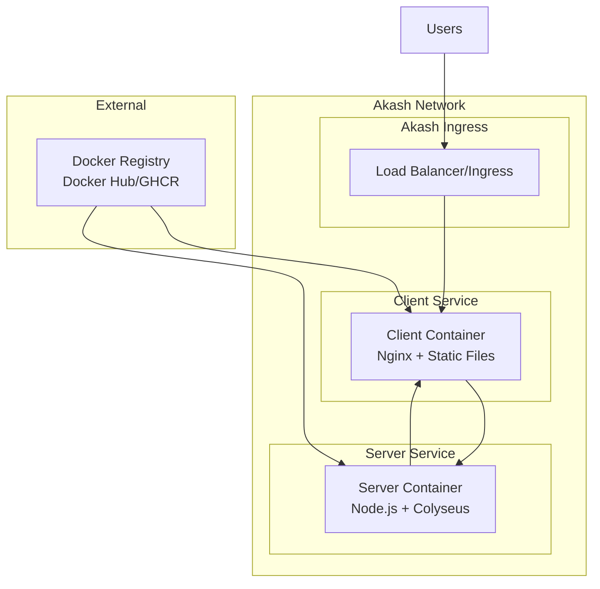

# Design Document

## Overview

This design outlines the containerization and deployment strategy for a KAPLAY + Colyseus multiplayer air hockey game on Akash Network. The solution involves creating optimized Docker containers for both the client (frontend) and server (backend) components, configuring them for production deployment, and creating Akash deployment manifests that leverage the decentralized cloud infrastructure.

The architecture follows a microservices approach where the client and server are deployed as separate services that communicate through defined network interfaces. The deployment utilizes Akash Network's container orchestration capabilities to provide a scalable, decentralized hosting solution.

## Architecture

### High-Level Architecture



### Container Architecture

**Client Container:**
- Base: nginx:alpine
- Contains: Built static files from Vite build process
- Serves: Static HTML, CSS, JS files
- Configuration: Nginx config for SPA routing and proxy setup

**Server Container:**
- Base: node:18-alpine
- Contains: Compiled TypeScript server code
- Runs: Colyseus game server on port 2567
- Features: WebSocket support, monitoring endpoints

## Components and Interfaces

### 1. Client Container Component

**Purpose:** Serve the frontend application and handle client-side routing

**Key Features:**
- Multi-stage Docker build for optimization
- Nginx configuration for Single Page Application routing
- Environment variable injection for server endpoint configuration
- Static asset optimization and compression

**Interfaces:**
- HTTP Port 80: Serves static files and handles client requests
- Proxy Configuration: Routes API calls to server container

### 2. Server Container Component

**Purpose:** Run the Colyseus game server and handle multiplayer game logic

**Key Features:**
- Node.js runtime with TypeScript compilation
- WebSocket server for real-time communication
- Health check endpoints for monitoring
- Environment-based configuration

**Interfaces:**
- HTTP/WebSocket Port 2567: Main game server port
- Health Check Endpoint: `/hello_world` for service monitoring
- Monitor Endpoint: `/colyseus` for server monitoring (production-secured)

### 3. Akash Deployment Manifest

**Purpose:** Define resource requirements and service configuration for Akash Network

**Key Components:**
- Service definitions for client and server
- Resource allocation (CPU, memory, storage)
- Network configuration and port exposure
- Ingress rules for external access

## Data Models

### Environment Configuration

```typescript
interface ServerConfig {
  NODE_ENV: 'production' | 'development';
  PORT: number;
  CORS_ORIGIN: string;
  MONITOR_PASSWORD?: string;
}

interface ClientConfig {
  VITE_SERVER_URL: string;
  VITE_SERVER_WS_URL: string;
}
```

### Akash Deployment Schema

```yaml
# Resource allocation model
resources:
  cpu: "0.5"      # CPU units
  memory: "512Mi"  # Memory allocation
  storage: "1Gi"   # Storage allocation

# Service exposure model
expose:
  - port: 80
    as: 80
    proto: tcp
    to:
      - global: true
```

## Error Handling

### Container-Level Error Handling

1. **Health Checks:** Both containers implement health check endpoints
2. **Graceful Shutdown:** Proper signal handling for container termination
3. **Restart Policies:** Automatic restart on failure
4. **Resource Limits:** Prevent resource exhaustion

### Network-Level Error Handling

1. **Connection Retry Logic:** Client reconnection on WebSocket failures
2. **CORS Configuration:** Proper cross-origin request handling
3. **Proxy Timeouts:** Appropriate timeout configurations
4. **Load Balancing:** Akash ingress handles service availability

### Deployment-Level Error Handling

1. **Resource Monitoring:** Track CPU, memory, and storage usage
2. **Service Discovery:** Automatic service endpoint resolution
3. **Rollback Strategy:** Ability to revert to previous deployment versions
4. **Logging:** Structured logging for debugging and monitoring

## Testing Strategy

### Container Testing

1. **Build Verification:**
   - Verify Docker images build successfully
   - Test container startup and health checks
   - Validate environment variable injection

2. **Integration Testing:**
   - Test client-server communication in containerized environment
   - Verify WebSocket connections work through container networking
   - Test proxy configurations and routing

### Deployment Testing

1. **Local Testing:**
   - Docker Compose setup for local development
   - Test complete stack before Akash deployment
   - Validate resource requirements and limits

2. **Akash Network Testing:**
   - Deploy to Akash testnet first
   - Test public accessibility and performance
   - Verify scaling and resource allocation
   - Test deployment updates and rollbacks

### Performance Testing

1. **Load Testing:**
   - Test concurrent player connections
   - Verify WebSocket performance under load
   - Monitor resource usage during peak usage

2. **Network Testing:**
   - Test latency and connection stability
   - Verify CORS and proxy configurations
   - Test from different geographic locations

## Security Considerations

### Container Security

1. **Base Image Security:** Use official, minimal base images
2. **Non-Root User:** Run containers with non-privileged users
3. **Secret Management:** Secure handling of environment variables
4. **Image Scanning:** Regular vulnerability scanning of container images

### Network Security

1. **CORS Configuration:** Restrict origins appropriately
2. **Rate Limiting:** Implement connection rate limiting
3. **SSL/TLS:** Enable HTTPS through Akash ingress
4. **Monitor Access:** Secure monitoring endpoints in production

### Akash-Specific Security

1. **Resource Limits:** Prevent resource abuse
2. **Network Policies:** Restrict unnecessary network access
3. **Deployment Validation:** Verify deployment manifests before submission
4. **Access Control:** Secure deployment and management access